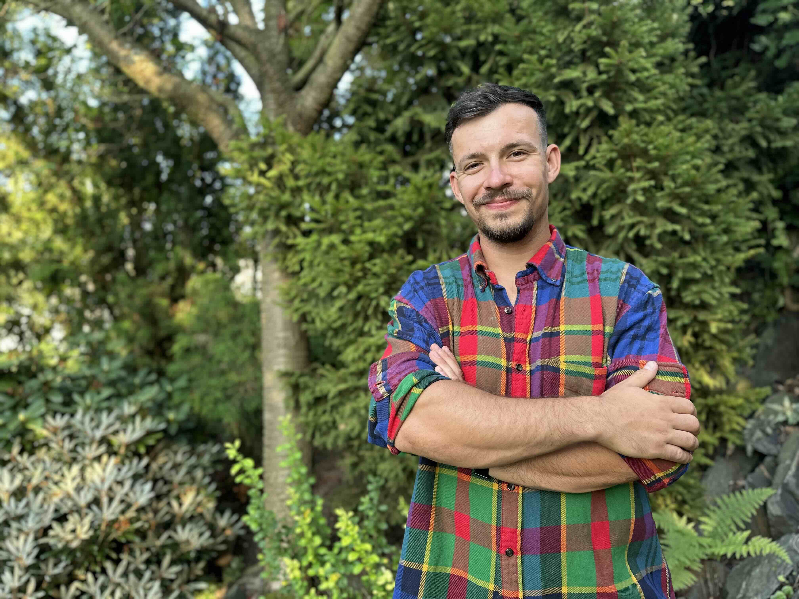

# Web psychoterapeutické péče

## Co kde je

- `index.html` – obsah a struktura stránky (texty, sekce)
- `styles.css` – vzhled (barvy, fonty, rozložení)
- `script.js` – interaktivita (menu, formulář)

## Co upravit jako první

V souboru `index.html` najděte a změňte:

1. **Jméno a titul** – vyhledejte „Jana Nováková" (objevuje se 3×)
2. **Vzdělání a kvalifikace** – sekce "O mně", seznam pod textem
3. **Ceny služeb** – sekce „Služby", v každé kartě je řádek s cenou
4. **Kontaktní údaje** – sekce „Kontakt":
   - e-mail: `terapie@example.cz`
   - telefon: `+420 777 123 456`
   - adresa: `Vodičkova 12, Praha 1`
5. **IČO** v patičce

V souboru `script.js` změňte e-mail u řádku `mailto:terapie@example.cz`.

## Fotografie

Na webu jsou dva placeholdery pro obrázky. Až budete mít fotky:
1. Uložte je do složky projektu (např. `foto-portret.jpg`)
2. V `index.html` najděte `<div class="image-placeholder">` a nahraďte za:
   ```html
   
   ```
3. Do `styles.css` přidejte:
   ```css
   .profile-image { width: 100%; height: auto; border-radius: 2px; }
   ```
